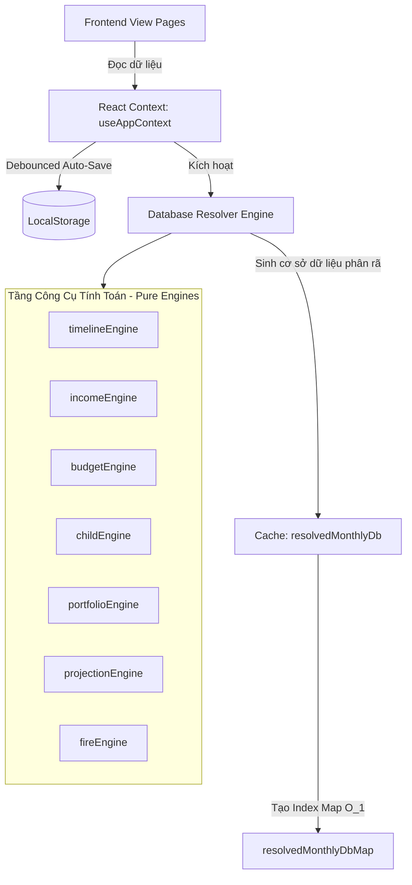

# HỆ THỐNG QUẢN TRỊ TÀI CHÍNH GIA ĐÌNH - FINANCE FAMILY OS
## TÀI LIỆU THIẾT KẾ KIẾN TRÚC & TÍNH NĂNG CHI TIẾT

Tài liệu này cung cấp cái nhìn toàn diện về mặt nghiệp vụ tài chính, thiết kế kiến trúc hệ thống, cấu trúc cơ sở dữ liệu ngầm (Materialized Cache), tầng giao diện (Frontend UI/UX) và các công thức toán học vận hành hệ thống Finance Family OS.

---

## 1. KỊCH BẢN NGHIỆP VỤ TÀI CHÍNH (BUSINESS SCENARIO)

Hệ thống được thiết kế dựa trên kịch bản thực tế của gia đình Việt Nam hiện đại:
*   **Thành viên**: Chồng **Gia Khánh (30 tuổi)** và Vợ **Minh Anh (28 tuổi)**.
*   **Thu nhập khởi điểm**: **80 Triệu VND/tháng** (Tháng 10/2026), cấu hình điều chỉnh chủ động theo các mốc thay đổi nguồn thu.
*   **Các sự kiện tài chính trọng đại trong đời**:
    1.  **Mua xe ô tô (Tháng 12/2027)**: Chi phí **-800 Triệu VND**.
    2.  **Đón con đầu lòng chào đời (Tháng 10/2031)**: Chi phí sinh đẻ ban đầu **-150 Triệu VND**. Kích hoạt chế độ nuôi con cố định (Premium Lifestyle - Trần chi phí tối đa 35M/tháng, điều chỉnh theo lạm phát giáo dục/y tế).
    3.  **Mua nhà chung cư (Tháng 06/2035)**:
        *   Tổng giá trị bất động sản: **3.5 Tỷ VND**.
        *   Trả trước (Downpayment): **1.5 Tỷ VND** (Ghi giảm trực tiếp số dư Chứng khoán).
        *   Khoản vay ngân hàng: **2.0 Tỷ VND**.
        *   Nghĩa vụ nợ trả góp phát sinh hàng tháng: **-20 Triệu VND/tháng** (Ghi giảm dòng tiền thặng dư).
    4.  **Học phí Đại học của con (Tháng 09/2049)**: Chi phí chuẩn bị ban đầu **-300 Triệu VND**.
    5.  **Nghỉ hưu sớm & FIRE (Từ năm 2050 - 2060)**: Chồng 54 tuổi, vợ 52 tuổi. Thu nhập chủ động giảm về mức **25 Triệu VND/tháng** (từ tư vấn bán thời gian), gia đình sống chủ yếu bằng lợi suất từ danh mục đầu tư tích lũy.

---

## 2. KIẾN TRÚC HỆ THỐNG (SYSTEMS ARCHITECTURE)

Hệ thống được thiết kế theo mô hình **Single-Page Application (SPA)** hiện đại, đề cao hiệu năng tính toán và trải nghiệm mượt mà không có độ trễ:



### Các tầng kiến trúc cốt lõi:
1.  **Tầng Giao diện (Frontend Layer)**: Xây dựng trên nền **React 19**, **Vite**, **TypeScript** và **TailwindCSS**. Sử dụng hệ thống biểu đồ **Recharts** và icon **Lucide React**.
2.  **Tầng Công cụ Tính toán (Pure Logic Engines)**: Hệ thống các hàm thuần túy (deterministic pure functions), không có tác dụng phụ (side-effects), chịu trách nhiệm nhân chia dòng tiền, tính lãi kép, tính lạm phát:
    *   `timelineEngine`: Phát sinh chuỗi tháng từ mốc bắt đầu tới kết thúc.
    *   `incomeEngine`: Giải quyết nguồn thu nhập của từng tháng.
    *   `budgetEngine`: Áp dụng quy tắc phân bổ ngân sách 5 nhóm chính và các chi phí đặc thù.
    *   `childEngine`: Mô phỏng chi phí nuôi con lũy tiến theo tuổi và lạm phát đặc thù.
    *   `portfolioEngine`: Quản lý tăng trưởng lãi kép của 5 lớp tài sản.
    *   `projectionEngine`: Chạy vòng lặp mô phỏng tài sản ròng qua 411 tháng.
    *   `fireEngine`: Đánh giá trạng thái Tự do tài chính (FIRE).
3.  **Tầng Cơ sở Dữ liệu Đệm (Materialized View & Cache Layer)**: Tự động chạy ngầm mỗi khi có thay đổi đầu vào để sinh ra bảng dữ liệu phẳng giải quyết sẵn (`resolvedMonthlyDb`) và bảng chỉ mục (`resolvedMonthlyDbMap`) phục vụ truy vấn tức thì.

---

## 3. THIẾT KẾ CƠ SỞ DỮ LIỆU (DATA SCHEMAS & PERSISTENCE)

### 3.1. Schema bảng phân rã tháng (`ResolvedMonthlyDbItem`)
Bản ghi cơ sở dữ liệu phẳng đại diện cho trạng thái tài chính hoàn chỉnh của một tháng:

```typescript
export interface ResolvedMonthlyDbItem {
  periodKey: string;             // Khóa định dạng YYYY-MM (Ví dụ: 2026-10)
  month: number;                 // Tháng (1 - 12)
  year: number;                  // Năm (2026 - 2060)
  income: number;                // Thu nhập thực tế giải quyết cho tháng đó (Tr VND)
  expectedReturnAnnual: number;  // Lợi suất kỳ vọng bình quân gia quyền của danh mục đầu tư (%)
  
  // Tỷ trọng chi tiêu phân bổ cho 7 nhóm ngân sách chính (%)
  budgetRatios: {
    housing_basic: number;       // Nhà cửa & Sinh hoạt cơ bản
    future_investing: number;    // Tương lai & Đầu tư
    safety_reserve: number;      // Bình an & Dự phòng
    family_experience: number;   // Yêu thương & Sự kiện
    health_growth: number;       // Sức khỏe & Phát triển
    children: number;            // Nuôi con (Tính tự động theo childEngine)
    parents: number;             // Phụng dưỡng bố mẹ
  };
  
  // Giá trị tiền mặt tuyệt đối tương ứng của từng nhóm (Tr VND)
  budgetAmounts: {
    housing_basic: number;
    future_investing: number;
    safety_reserve: number;
    family_experience: number;
    health_growth: number;
    children: number;
    parents: number;
  };
}
```

### 3.2. Cấu trúc Index bản đồ tra cứu nhanh (`resolvedMonthlyDbMap`)
Để tối ưu hóa hiệu năng truy vấn từ `O(N)` về `O(1)`:
```typescript
export type ResolvedMonthlyDbMap = Record<string, ResolvedMonthlyDbItem>;
```
Khi người dùng chọn một cột mốc trên giao diện, hệ thống chỉ cần gọi trực tiếp `state.resolvedMonthlyDbMap[periodKey]` thay vì phải duyệt qua mảng 411 tháng.

### 3.3. Cơ chế Lưu trữ & Di trú (Migration & Persistence)
*   **Đồng bộ tự động**: Trạng thái được tự động tuần tự hóa sang chuỗi JSON và lưu trữ vào `localStorage` khóa `family_finance_os_state` với cơ chế **Debounced 500ms** để tránh ghi đĩa liên tục khi người dùng gõ phím.
*   **Di trú Schema (Migration)**: Tệp `src/utils/migration.ts` kiểm soát phiên bản cấu trúc dữ liệu (`schemaVersion`). Nếu người dùng mở ứng dụng từ phiên bản cũ, hệ thống sẽ tự động bù đắp các trường dữ liệu thiếu, định dạng lại mảng tài sản để ngăn chặn tuyệt đối lỗi sập ứng dụng (app crash).

---

## 4. THIẾT KẾ CÁC MÀN HÌNH CHỨC NĂNG (FRONTEND DESIGN)

### 4.1. Màn hình Nhật ký Lịch sử Ngân sách (Budget History)
Được phân tách thành 2 Không gian làm việc (Tabs) chuyên biệt:

#### Tab 1: Trực quan hóa BI (Chiếm 100% chiều ngang rộng rãi)
*   **Nhãn thông tin mốc báo cáo**: Hiển thị tên mốc thời gian đang xem và **Thu nhập thực tế** của mốc đó trích từ `resolvedMonthlyDb` (Ví dụ: "Thu nhập thực tế mốc: 80.0 Tr VND").
*   **Cơ cấu mốc hiện tại (Bên trái)**: Tích hợp sơ đồ dạng cây **Power BI Decomposition Tree** hiển thị dòng chảy phân cấp:
    $$\text{Thu nhập gốc} \longrightarrow \text{Nhóm chi tiêu chính} \longrightarrow \text{Hạng mục con (Leaf nodes)}$$
    Người dùng có thể chuyển đổi sang biểu đồ **Sunburst Double-Donut** ẩn toàn bộ văn bản ghi trên vành đai ngoài để tránh chồng chéo chữ, xem chi tiết qua Tooltip cao cấp khi di chuột.
*   **Biến động tỷ trọng qua các mốc (Bên phải)**: Biểu đồ cột chồng (Stacked Bar Chart) thể hiện sự dịch chuyển cơ cấu tỷ trọng (%) của 5 nhóm chính giữa các phiên bản điều chỉnh ngân sách.
*   **Xu hướng chi phí theo thời gian (Bên dưới - 100% chiều rộng)**: Biểu đồ cột nhóm (Grouped Bar Chart) hiển thị giá trị tiền mặt thực tế (Tr VND) của từng nhóm chi tiêu qua các mốc, tự động cập nhật phản ánh đúng sự biến động của nguồn thu thực tế tại các thời điểm đó.

#### Tab 2: Biên tập Cây tỷ lệ
*   **Timeline Navigator (Cột trái)**: Thanh dòng thời gian dọc hiển thị các mốc thay đổi ngân sách theo thứ tự thời gian. Cho phép:
    *   Thêm mốc điều chỉnh mới.
    *   Reset cấu hình về mặc định.
    *   Trạng thái **Quick Save (Nút cam)** hiển thị trên đầu timeline khi phát hiện dữ liệu cục bộ bị thay đổi so với bản ghi lưu trữ.
*   **Workspace Editor (Bảng phải)**: Cho phép sửa đổi Tháng/Năm hiệu lực, ghi chú mốc và biên tập cây tỷ lệ đệ quy. Người dùng có thể bật/tắt kích hoạt các nhóm/hạng mục con và thay đổi tỷ trọng trực tiếp.

---

### 4.2. Màn hình Thu nhập theo thời gian (Income Schedule)
Đồng bộ tư duy thiết kế hai Tab rộng rãi:
*   **Tab 1: Trực quan hóa BI**:
    *   Bộ ba thẻ KPI: Số mốc biến động, Thu nhập khởi điểm, và Chu kỳ hoạch định.
    *   Biểu đồ vùng (Area Chart) biểu diễn xu hướng phát triển thu nhập từ 2026 đến 2060 với lưới chia năm mượt mà.
    *   Bảng tóm tắt gọn gàng hiển thị chi tiết các thời điểm thay đổi nguồn thu.
*   **Tab 2: Biên tập mốc thu nhập**:
    *   Phía trái là Timeline Navigator hỗ trợ thêm/xóa mốc thu nhập nhanh.
    *   Phía phải là bảng điều khiển biên tập 3 tham số sạch: Tháng hiệu lực, Năm hiệu lực và Mức thu nhập cố định của mốc. Loại bỏ hoàn toàn trường tăng trưởng tự động để đề cao tính kiểm soát chủ động của gia đình.

---

### 4.3. Màn hình Danh mục Đầu tư (Portfolio)
*   **Quản lý 5 lớp tài sản**: Cho phép tinh chỉnh Số dư ban đầu, Tỷ trọng phân bổ mục tiêu, Lợi suất kỳ vọng năm, và đặc biệt là **Năm bắt đầu đầu tư** để tracking nguồn gốc tài sản.
*   **Lợi suất kỳ vọng bình quân gia quyền của danh mục (Portfolio Yield)**:
    $$\text{Portfolio Expected Return} = \frac{\sum_{i=1}^{n} (\text{Asset Target Allocation}_i \times \text{Asset Expected Return}_i)}{100}$$
    Chỉ số này tự động cập nhật tức thời khi thay đổi phân bổ tài sản và đóng vai trò làm lãi suất chiết khấu/tích lũy cho toàn bộ chu kỳ 35 năm kế tiếp.
*   **Biểu đồ tròn phân bổ (Pie Chart)**: Trực quan hóa tỷ trọng các lớp tài sản tích lũy, hiển thị số tiền mặt khởi điểm quy đổi tương ứng trong Tooltip.

---

## 5. TOÁN HỌC & LOGIC TÍNH TOÁN DỰ PHÒNG (ENGINE FORMULAS)

### 5.1. Khấu trừ chi phí trẻ em (Child Cost Inflation Adjustments)
Chi phí nuôi con tại tháng thứ $t$ kể từ khi sinh ra ($t = 0$ tại Tháng 10/2031) được điều chỉnh theo lạm phát y tế ($I_m$) và lạm phát giáo dục ($I_e$):
*   **Giai đoạn sơ sinh (0 - 5 tuổi)**: Áp dụng lạm phát y tế/nhu yếu phẩm:
    $$\text{Cost}_t = \text{BaseCost}_0 \times \left(1 + \frac{I_m}{12}\right)^t$$
*   **Giai đoạn đi học (6 - 17 tuổi)**: Áp dụng lạm phát giáo dục:
    $$\text{Cost}_t = \text{BaseCost}_6 \times \left(1 + \frac{I_e}{12}\right)^{t - 72}$$

### 5.2. Công thức Dự phòng Tự do tài chính (FIRE Equation)
Mục tiêu tự do tài chính dựa trên quy tắc rút tiền 4% an toàn và chi phí thực tế hàng tháng tại thời điểm khảo sát:
$$\text{FIRE Target} = \frac{\text{Chi phí tháng thực tế} \times 12}{0.04} = \text{Chi phí tháng thực tế} \times 300$$
Nếu số dư Tài sản tích lũy đạt hoặc vượt mức `FIRE Target`, gia đình chính thức đạt trạng thái Tự do Tài chính.

---

## 6. KHẢ NĂNG BẢO TRÌ & NÂNG CẤP TƯƠNG LAI
*   **Khả năng mở rộng**: Nhờ tách biệt hoàn toàn Tầng giao diện (React Components) và Tầng lõi nghiệp vụ (Pure Engines), các nhà phát triển sau này có thể nâng cấp thuật toán mô phỏng tăng trưởng tài sản (như chạy mô phỏng Monte Carlo ngẫu nhiên cho danh mục cổ phiếu) mà không cần thay đổi bất kỳ dòng code giao diện nào.
*   **Backup & Restore**: Hỗ trợ xuất (Export) toàn bộ cấu hình tài chính gia đình thành file `.json` nhẹ và nhập (Import) lại tức thì, thuận tiện cho việc lưu trữ nhiều kịch bản đời sống khác nhau.
