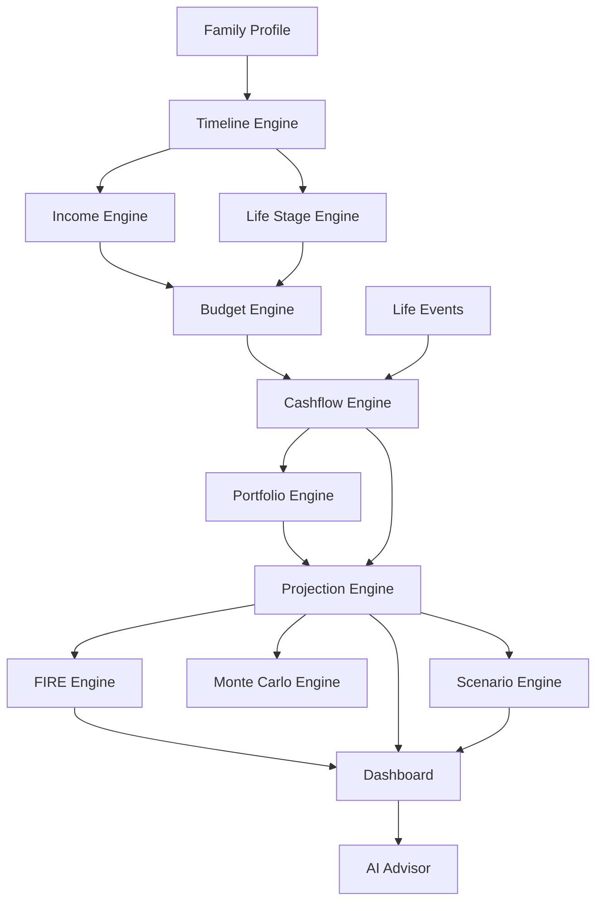

# 05 — SYSTEM ARCHITECTURE

## Architecture style

- Timeline-first
- Engine-based
- Event-driven
- Scenario-aware
- Local-first MVP
- AI-native development

## High-level flow



## Layering

```txt
UI Layer: pages, components
Application Layer: hooks, state, storage
Domain Layer: types, engines
Data Layer: defaultInputs, defaultRatios, knowledgeBase, vietnamAssumptions
```

## Engine dependency order

```txt
timelineEngine
  ↓
incomeEngine
  ↓
lifeStageEngine
  ↓
budgetEngine
  ↓
cashflowEngine
  ↓
childEngine
  ↓
portfolioEngine
  ↓
projectionEngine
  ↓
fireEngine
  ↓
monteCarloEngine
  ↓
scenarioEngine
```

## Derived state

Không lưu như source of truth:

- projection rows
- dashboard KPIs
- FIRE year
- portfolio PnL
- net worth
- budget amount monthly

Tất cả derive từ engine.

## LocalStorage

```ts
type PersistedAppState = {
  schemaVersion: number
  updatedAt: string
  data: AppState
}
```

## Scenario architecture

Base AppState + Scenario Overrides → Resolved Scenario State → Same Engines → Scenario Projection.

## Error handling

Engine không throw làm trắng màn hình. Engine trả data + warnings + errors.
