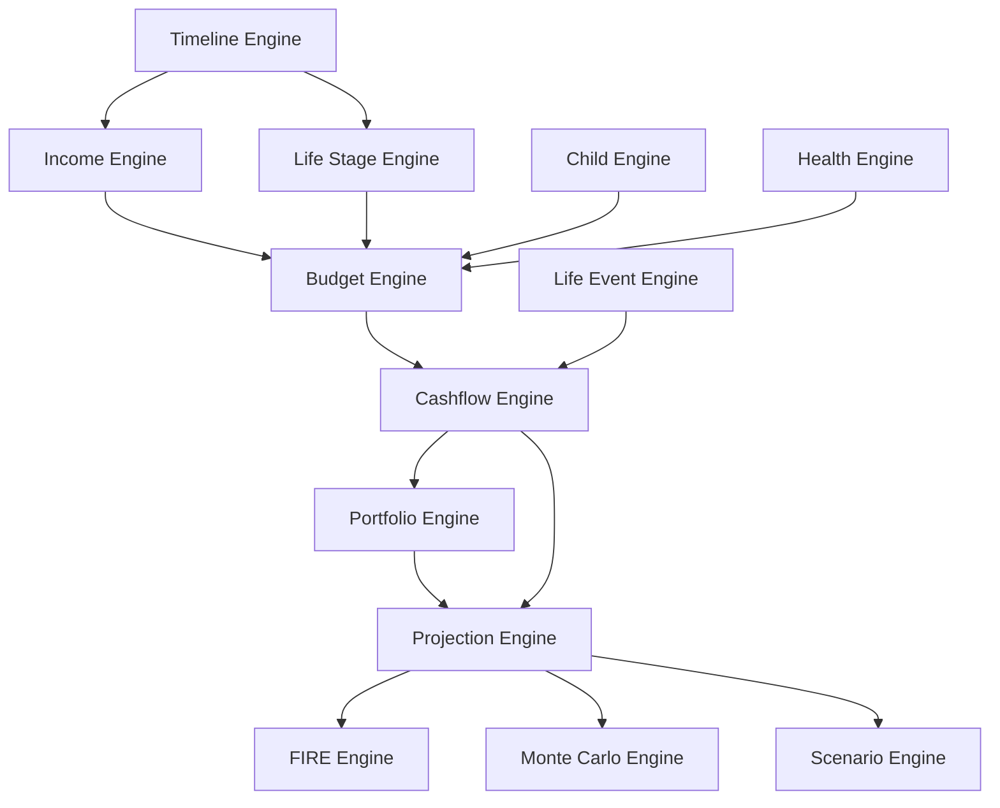

# 07 — FINANCIAL ENGINES

## 1. Engine Philosophy

Financial Engines là trái tim của Family Financial OS.

UI không tính toán.  
Engines nhận input, chạy theo timeline, trả output có thể render.

Engine phải:

- pure function càng nhiều càng tốt
- deterministic
- testable
- không phụ thuộc React
- không đọc trực tiếp LocalStorage
- không mutate input

---

## 2. Engine Dependency Map



---

## 3. Timeline Engine

### Purpose

Tạo monthly timeline từ start date đến end date.

### Input

```ts
type TimelineInput = {
  planningStartMonth: number
  planningStartYear: number
  planningEndMonth: number
  planningEndYear: number
  husbandAgeAtStart: number
  wifeAgeAtStart: number
}
```

### Output

```ts
type TimelinePeriod = {
  index: number
  key: string
  month: number
  year: number
  husbandAge: number
  wifeAge: number
}
```

### Rules

- Month range inclusive.
- Nếu end < start → return warning/error.
- Age tăng theo năm, không cần theo birthday exact ở MVP.

---

## 4. Income Engine

### Purpose

Resolve thu nhập theo tháng từ income schedule.

### Input

```ts
type IncomeEngineInput = {
  period: TimelinePeriod
  incomeSchedule: IncomeScheduleItem[]
}
```

### Output

```ts
type IncomeOutput = {
  incomeMonthly: number
  activeScheduleId: string
  warnings: string[]
}
```

### Logic

1. Sort schedule by effective date.
2. Find latest item whose effective date <= current period.
3. Apply growth from effective date to current period.

Formula:

```txt
monthsElapsed = monthsBetween(effectiveDate, currentDate)
monthlyGrowth = (1 + annualGrowth)^(1/12) - 1
income = baseIncome * (1 + monthlyGrowth)^monthsElapsed
```

---

## 5. Budget Engine

### Purpose

Resolve ngân sách tháng hiện tại từ income + active budget schedule + rules.

### Input

```ts
type BudgetEngineInput = {
  period: TimelinePeriod
  incomeMonthly: number
  budgetSchedule: BudgetRatioScheduleItem[]
  activeLifeStage?: LifeStage
  childCost?: ChildCostOutput
  healthState?: HealthState
  capsState?: CapsState
}
```

### Output

```ts
type MonthlyBudgetOutput = {
  month: number
  year: number
  incomeMonthly: number
  categories: BudgetCategoryOutput[]
  totalAllocatedMonthly: number
  totalExpenseMonthly: number
  investmentMonthly: number
  savingMonthly: number
  freeCashflowMonthly: number
  deficitMonthly: number
  warnings: string[]
}
```

### Rules

- Default allocation is ratio-based.
- No fixed money default.
- Category amount = income * ratio / 100 unless ruleType overrides.
- Child cost category can be injected from childEngine.
- Health/liquidity cap can stop contribution.
- Total ratio warning if not 100%.

### Default Budget Ratios

| Group | Ratio |
|---|---:|
| Nhà cửa & sinh hoạt cơ bản | 29% |
| Tương lai & đầu tư | 40% |
| Bình an & dự phòng | 10% |
| Gia đình & trải nghiệm | 11% |
| Sức khỏe & phát triển | 10% |

---

## 6. Child Engine

### Purpose

Tính chi phí con theo tháng/năm dựa trên tuổi con, lifestyle và override.

### Input

```ts
type ChildEngineInput = {
  period: TimelinePeriod
  childBirthMonth?: number
  childBirthYear?: number
  lifestyle: "basic" | "comfortable" | "premium" | "international"
  budgetCapMonthly?: number
  educationInflationAnnual: number
  healthInflationAnnual: number
  overrides?: Record<string, Partial<ChildCostOutput>>
}
```

### Output

```ts
type ChildCostOutput = {
  isActive: boolean
  childAge?: number
  food: number
  education: number
  englishSkills: number
  healthcare: number
  clothesSupplies: number
  travelExperience: number
  universityFund: number
  postGradSupport: number
  totalMonthly: number
  totalYearly: number
  notes: string[]
}
```

### Rules

- If period before child birth → inactive.
- Default for family: premium but capped at 35tr/month.
- No default RMIT/du học.
- University VN quality: 15–25tr/month.
- Post-grad support decreases:
  - age 22: 10tr
  - age 23: 7tr
  - age 24: 5tr
  - age 25+: 0

---

## 7. Cashflow Engine

### Purpose

Combine budget output + life events to produce monthly cashflow.

### Input

```ts
type CashflowInput = {
  period: TimelinePeriod
  budget: MonthlyBudgetOutput
  lifeEvents: LifeEvent[]
}
```

### Output

```ts
type CashflowOutput = {
  incomeMonthly: number
  expensesMonthly: number
  investmentMonthly: number
  savingMonthly: number
  childCostMonthly: number
  lifeEventImpactMonthly: number
  oneTimeEventImpact: number
  netCashflowMonthly: number
  warnings: string[]
}
```

### Rules

- Events in current period apply one-time amount.
- Recurring impact applies from event month onward if configured.
- Child cost is not subtracted directly from investment.
- Negative net cashflow creates warning.

---

## 8. Portfolio Engine

### Purpose

Simulate asset balances and PnL.

### Assets

- USD
- Crypto
- Bất động sản
- Chứng khoán

### Monthly Formula

```txt
monthlyReturn = annualReturn / 12
pnl = (beginningBalance + contribution * 0.5) * monthlyReturn
endingBalance = beginningBalance + contribution + pnl
```

### Override Rules

- If actual return exists → use actual.
- If balance override exists → use override as beginning balance.
- If actual contribution exists → use actual contribution.

---

## 9. Projection Engine

### Purpose

Run full monthly simulation and aggregate yearly.

### Input

```ts
type ProjectionInput = {
  familyProfile: FamilyProfile
  incomeSchedule: IncomeScheduleItem[]
  budgetSchedule: BudgetRatioScheduleItem[]
  lifeStages: LifeStage[]
  lifeEvents: LifeEvent[]
  childConfig: ChildConfig
  portfolioConfig: PortfolioConfig
  assumptions: Assumptions
}
```

### Output

```ts
type ProjectionOutput = {
  monthlyRows: ProjectionMonthlyRow[]
  yearlyRows: ProjectionYearlyRow[]
  warnings: string[]
}
```

### Steps

For each timeline period:

1. Resolve income.
2. Resolve life stage.
3. Calculate child cost.
4. Calculate budget.
5. Calculate cashflow.
6. Apply life events.
7. Update portfolio.
8. Update savings/investment balances.
9. Calculate net worth.
10. Calculate real value.
11. Calculate FIRE target/progress.

---

## 10. FIRE Engine

### Purpose

Calculate FIRE target, progress and expected FIRE date.

### Formula

```txt
FIRE Target = Annual Expenses / Withdrawal Rate
```

Default withdrawal rate = 4%.

### Output

```ts
type FireOutput = {
  fireTarget: number
  fireProgress: number
  fireGap: number
  expectedFirePeriod?: string
  withdrawalRate: number
}
```

### Rules

- Future FIRE target must use future expenses.
- No hardcoded FIRE year.
- FIRE year comes from projection crossing target.

---

## 11. Monte Carlo Engine

### Purpose

Estimate probability of reaching FIRE under uncertainty.

### Inputs

- return mean
- return volatility
- inflation mean
- inflation volatility
- income growth
- expense growth
- investment contribution
- life events
- child cost

### Output

```ts
type MonteCarloOutput = {
  simulations: number
  probabilityReachFire: number
  medianFireYear?: number
  p10FireYear?: number
  p90FireYear?: number
  successCount: number
  failureCount: number
  riskFactors: string[]
}
```

MVP can use simple random normal approximation.

---

## 12. Health Engine

### Purpose

Calculate health and final rest readiness.

### Inputs

- medicalInflationRate
- healthFundCap
- liquidityFundCap
- criticalIllnessReserveTarget
- finalRestCostToday
- finalRestInflationRate
- insuranceMonthly
- bhytMonthly

### Output

- requiredHealthFund
- currentHealthFund
- monthlyContributionNeeded
- yearsToReachHealthFund
- projectedMedicalCostFuture
- projectedFinalRestCostFuture
- readinessScore

---

## 13. Scenario Engine

### Purpose

Run projections with overrides.

### Logic

```txt
resolvedScenarioState = merge(baseState, scenario.overrides)
projection = projectionEngine(resolvedScenarioState)
```

Scenario không có công thức riêng.

---

## 14. Engine Acceptance Criteria

- Pure functions
- No React dependency
- No LocalStorage dependency
- No hardcoded money
- No hardcoded year
- Warnings returned clearly
- Build pass
